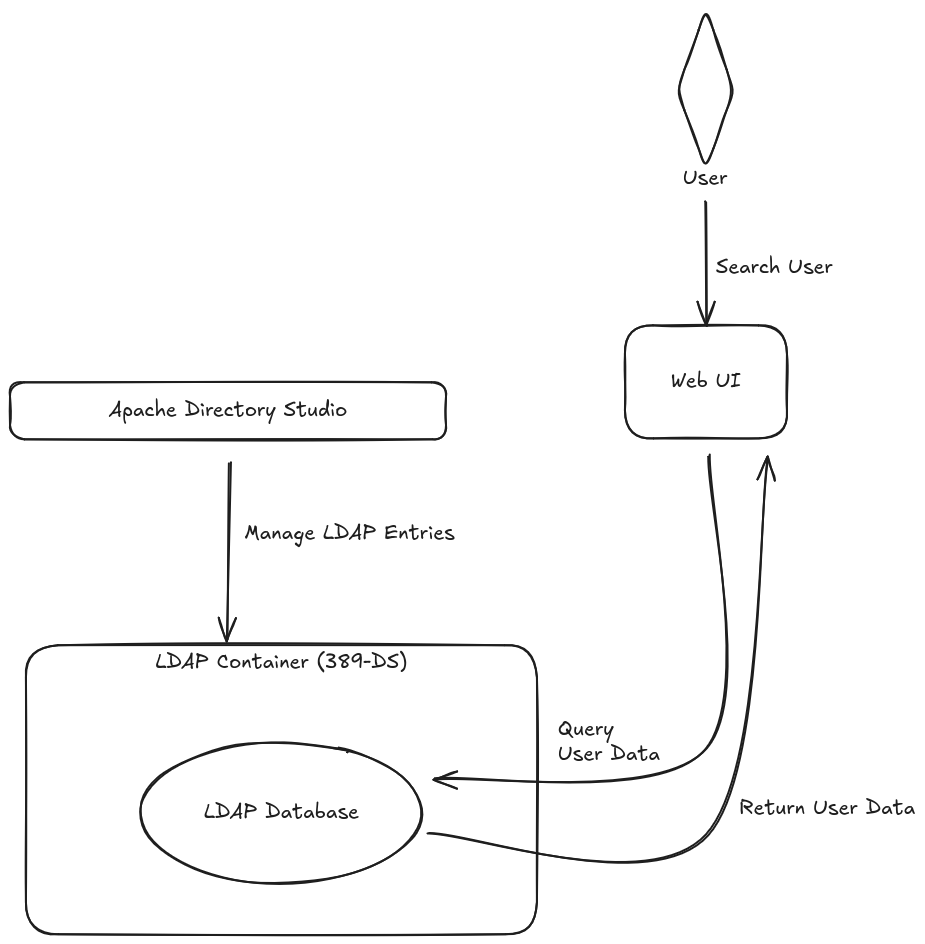

# Approach Paper - LDAP 389-Directory Server Setup in Podman

## Table of Contents

1. Objective  
2. Proposed Solutions  
   - Approach 1: Details  
     - Architecture Diagram  
     - Description  
     - Pre-requisites  
       - Hardware Requirements  
       - Software Requirements  
       - Networking Requirements  
   - Approach 2: Details  
     - Architecture Diagram  
     - Description  
     - Pre-requisites  
       - Hardware Requirements  
       - Software Requirements  
       - Networking Requirements  

---

## 1. Objective
To set up an LDAP 389-Directory Server using Podman and implement a UI-based LDAP Search system. The system should:

- Deploy LDAP 389-DS in a Podman container.  
- Use an LDIF file for user entries.  
- Set up Apache Directory Studio for LDAP management.  
- Develop a UI to search users by name.  

---

## 2. Proposed Solutions
### Approach 1: Containerized LDAP Server with Apache Directory Studio
- Deploy 389-DS LDAP server using Podman.  
- Configure LDIF file to add users.  
- Set up Apache Directory Studio for easy administration.  
- Build a simple web-based UI to search users.  

### Approach 2: Full Web-Based LDAP Management
- Deploy 389-DS with a REST API wrapper.  
- Use Apache Directory Studio and integrate with a React-based UI.  
- The UI communicates with LDAP via REST API.  

**Chosen Approach:** Approach 1  
**Reason:** It provides a straightforward, containerized LDAP setup while allowing Apache Directory Studio for easy administration.  

---

## 3. Approach 1: Details
### 3.1. Architecture Diagram

 

### 3.2. Description
This approach involves deploying the 389-DS LDAP server inside a Podman container. Users are added through an LDIF file, and the system is managed using Apache Directory Studio. A simple web UI is built to search for users by name.  

**Pros:**  
- Lightweight and containerized deployment.  
- Easy user management with Apache Directory Studio.  
- Simple UI for searching users.  

**Cons:**  
- Requires separate UI development.  
- No REST API support for third-party integrations.  

### 3.3. Pre-requisites
#### 3.3.1. Hardware Requirements
- Minimum 2GB RAM, 2 CPU Cores.  
- 10GB disk space.  

#### 3.3.2. Software Requirements
- Operating System: Ubuntu 22.04 / CentOS 8.  
- Podman: Latest version.  
- 389-DS: Installed inside the container.  
- Apache Directory Studio: For LDAP management.  
- PHP/React/JavaScript: For UI development.  

#### 3.3.3. Networking Requirements
- Open port 389 for LDAP.  
- Open port 443 for UI access.  
- Ensure Podman network bridge is configured.  

---

## 4. Approach 2: Details
### 4.1. Architecture Diagram
_(Insert architecture diagram here)_  

### 4.2. Description
In this approach, we set up 389-DS in a Podman container but also create a REST API wrapper that allows UI-based user management. The UI communicates with the API instead of directly querying LDAP.  

**Pros:**  
- Provides a modern, API-driven approach.  
- Scalable for future integrations.  

**Cons:**  
- More complex setup with additional REST API layer.  
- Increased development time.  

### 4.3. Pre-requisites
#### 4.3.1. Hardware Requirements
- Minimum 4GB RAM, 4 CPU Cores.  
- 20GB disk space.  

#### 4.3.2. Software Requirements
- Operating System: Ubuntu 22.04 / CentOS 8.  
- Podman & 389-DS LDAP Server.  
- Node.js & Express.js (for REST API).  
- React/Angular UI for frontend.  

#### 4.3.3. Networking Requirements
- Open port 389 for LDAP.  
- Open port 8080 for REST API.  
- Open port 443 for UI access.  

---

## Conclusion
We have chosen **Approach 1** as it provides a simpler, containerized LDAP setup with Apache Directory Studio for management and a lightweight UI-based search functionality.

